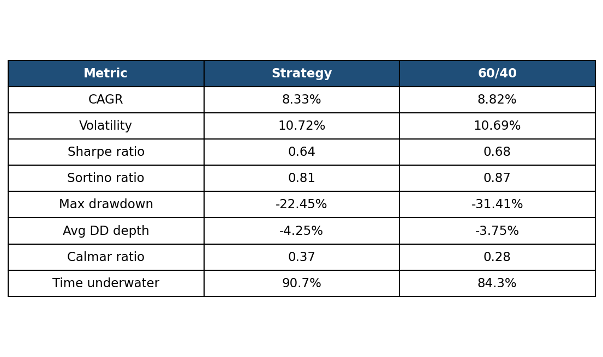
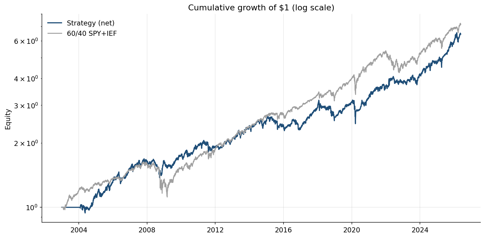
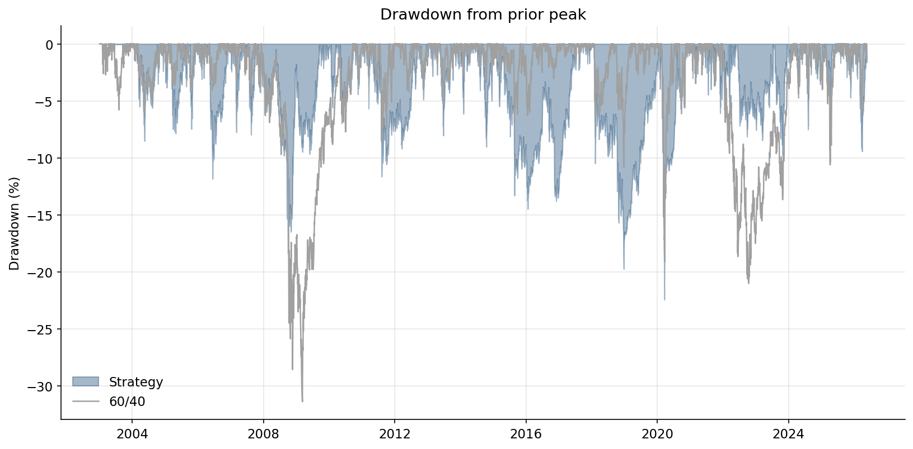
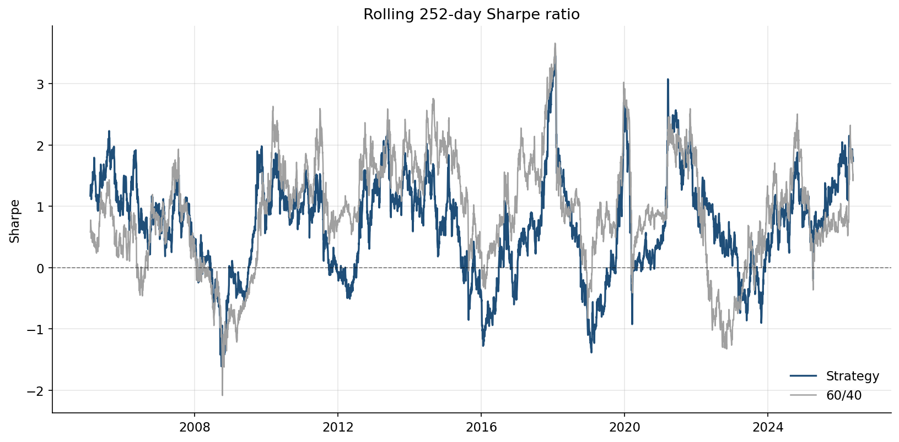
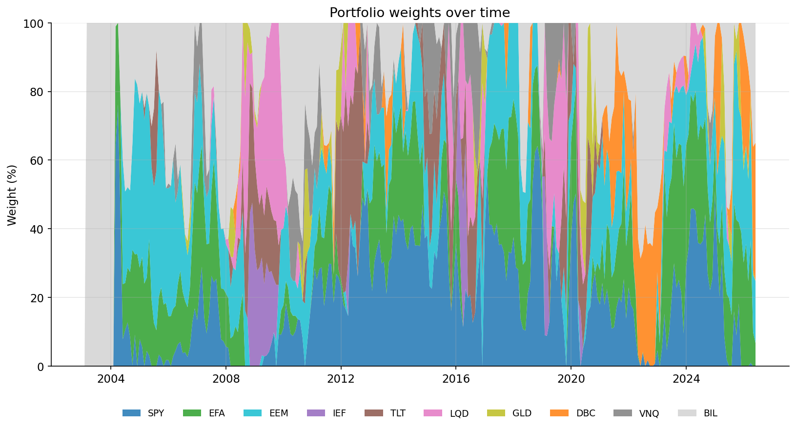

# Macro Carry Allocation

> A long-only multi-asset allocation strategy combining 12-month trend and cross-asset carry signals across nine ETFs, with monthly rebalancing, inverse-volatility position sizing, and portfolio-level volatility targeting at 10%.


## Overview

This project extends Meb Faber's *A Quantitative Approach to Tactical Asset Allocation* ([SSRN 962461](https://papers.ssrn.com/sol3/papers.cfm?abstract_id=962461)) by combining two signals with distinct economic motivations:

- **Trend** (behavioural premium): investors under-react to news, so prices that have risen tend to continue rising over multi-month horizons.
- **Carry** (risk premium): investors are paid to bear term, credit, devaluation, and storage risks. Assets currently offering higher carry are compensated for risks others want to offload.

The two signals are roughly uncorrelated within asset classes, so combining them diversifies risk-premium exposures rather than duplicating a single behavioural bet.

## Results

Backtest period: 2003-01-31 → 2026-05-20 (~22 years of out-of-sample-feeling history, given no parameter optimization on this window).



The strategy delivers comparable absolute return to a 60/40 SPY+IEF benchmark with **~9pp lower max drawdown** (-22.45% vs -31.41%). The Calmar ratio (return per unit of max drawdown) is meaningfully better (0.37 vs 0.28), confirming the strategy's value-add is concentrated in tail protection rather than mean return enhancement.





The drawdown plot is where the strategy most visibly differentiates from 60/40. In 2008-2009, vol targeting and diversification limited the strategy's drawdown to ~19% while 60/40 hit -31%. In 2022 (the simultaneous bond/equity selloff), the strategy stayed in a single-digit drawdown while 60/40 had a sustained -20% drawdown.



Rolling 1-year Sharpe ratios show the strategy and 60/40 co-moving with the overall equity environment. The strategy's relative outperformance is concentrated in EM-heavy periods (2010-2011) and the 2022-2023 stress period, while 60/40 wins in low-vol US equity bull-market periods (notably 2012-2015 QE).



The weights chart confirms the strategy is genuinely rotating: EM equity (EEM) dominates in 2009-2011; bonds (TLT/IEF, purple/brown) feature in 2015 and 2019; commodities (DBC, orange) take large positions during the 2021-2022 inflation shock; and the cash sleeve (BIL, grey) grows substantially in 2022 when vol-targeting scaled exposure down hard.

## Methodology

### Signal pipeline

For each of nine risk-asset ETFs (SPY, EFA, EEM, IEF, TLT, LQD, GLD, DBC, VNQ), compute two raw signals at each month-end:

- **Trend**: 12-month total return.
- **Carry**: asset yield minus 3-month T-bill yield, in decimal units.
  - *Equities*: trailing earnings yield (1 / index P/E) of the underlying index.
  - *Bonds and credit*: yield-to-worst of the underlying index.
  - *Gold*: zero asset yield, so carry equals minus the risk-free rate (you forgo T-bill yield to hold a non-yielding asset).
  - *Commodities*: weighted-average annualized log roll yield across the 14 commodities in the DBC index, computed from front-month and second-month generic futures prices.
  - *REITs*: trailing earnings yield from the RMZ index.

Then apply the three-stage transform pipeline on each rebalance date independently:

1. **Winsorize** each signal cross-sectionally using MAD-based ±3σ clipping. Robust to single outliers in a small cross-section (e.g. MXEA trailing P/E of 129 during the 2002-2003 earnings trough).
2. **Z-score** each signal cross-sectionally so trend and carry are on the same scale.
3. **Blend** with equal weights: composite = 0.5·z_trend + 0.5·z_carry. Assets with missing carry (RMZ pre-Oct 2005 for VNQ) get composite = z_trend (full weight on the available signal).

### Portfolio construction

A seven-step deterministic chain converts composite signals into actual weights:

1. Rank assets by composite z-score.
2. Select top 4.
3. Signal-proportional raw weights (negative composites floored at zero).
4. Inverse-volatility scaling using rolling 63-day annualized realized vol, so each held asset contributes equal risk to the portfolio.
5. Portfolio-level vol target at 10% annualized, using a constant-weights vol forecast that implicitly captures both asset vols and cross-asset correlations.
6. Gross leverage capped at 1.0 (no borrowing).
7. BIL cash sleeve absorbs any unused capital.

### Execution

Weights generated on month-end `t` are held from the open of `t+1` onwards — a one-day execution lag to avoid look-ahead bias. Transaction costs of 5bps per dollar of two-way turnover are applied on the execution day, conservative for liquid US-listed ETFs traded through a retail broker (Interactive Brokers or similar). Average monthly one-way turnover is ~20%; total cost drag over the full backtest is 0.28% per year.

## Project Structure

```
macro-carry-allocation/
├── README.md
├── requirements.txt
├── data/
│   ├── raw/                       # Bloomberg exports (gitignored, licensed data)
│   │   ├── macro_carry_data.xlsx
│   │   └── commodity_futures.xlsx
│   └── processed/                 # parquet cache (gitignored, reproducible)
├── src/
│   ├── data_loader.py             # Bloomberg workbook → DataFrames
│   ├── signals.py                 # trend, carry, winsorize, z-score, blend
│   ├── portfolio.py               # top-N, inverse-vol weights, vol target, cash sleeve
│   ├── backtest.py                # daily P&L with t+1 execution and costs
│   ├── metrics.py                 # CAGR, Sharpe, Sortino, drawdown analysis
│   └── make_charts.py             # produces results/ PNGs
└── results/
├── equity_curve.png
├── drawdown.png
├── rolling_sharpe.png
├── weights_history.png
└── metrics_table.png
```

Each module exposes a `__main__` smoke test that runs in isolation. The full pipeline is executed by `python src/make_charts.py`.

## Data Sources

All data sourced from a **Bloomberg Terminal** via manual BDH export. The raw `.xlsx` files are excluded from version control because Bloomberg data is licensed.

| Data type | Bloomberg field | Series | Sheet |
|---|---|---|---|
| ETF total return | `TOT_RETURN_INDEX_GROSS_DVDS` | SPY, EFA, EEM, IEF, TLT, LQD, GLD, DBC, VNQ, BIL | `prices` |
| Equity P/E | `PE_RATIO` | SPX, MXEA, MXEF, RMZ indices | `equity_pe` |
| Bond/credit yields | `INDEX_YIELD_TO_WORST` | LUATTRUU, LUTLTRUU, LUACTRUU indices | `bond_yields` |
| Risk-free | `PX_LAST` | USGG3M | `rf` |
| Commodity futures | `PX_LAST` | CL/CO/HO/XB/NG/GC/SI/LA/LX/LP/C/W/S/SB, front + second month | `futures` |

Date range: 2003-01-01 to present.

## v2 — Planned

The hand-coded 50/50 trend/carry blend is the obvious starting point but is unlikely to be optimal. v2 replaces it with regression-learned weights from a **walk-forward (expanding-window) framework**:

1. At each rebalance date `t`, train a Lasso/Ridge regression on (z_trend, z_carry) → next-month asset return using only data through `t`.
2. Use the learned coefficients to blend signals for `t+1`'s positions.
3. Re-train monthly; concatenate all out-of-sample predictions into the live backtest.

## References

- Asness, Moskowitz, Pedersen (2013). *Value and Momentum Everywhere*. Journal of Finance.
- Koijen, Moskowitz, Pedersen, Vrugt (2018). *Carry*. Journal of Financial Economics.
- Faber (2007). *A Quantitative Approach to Tactical Asset Allocation*. SSRN.
- Moreira, Muir (2017). *Volatility-Managed Portfolios*. Journal of Finance.

## License

MIT. All performance figures are backtest-derived; none of this is investment advice.